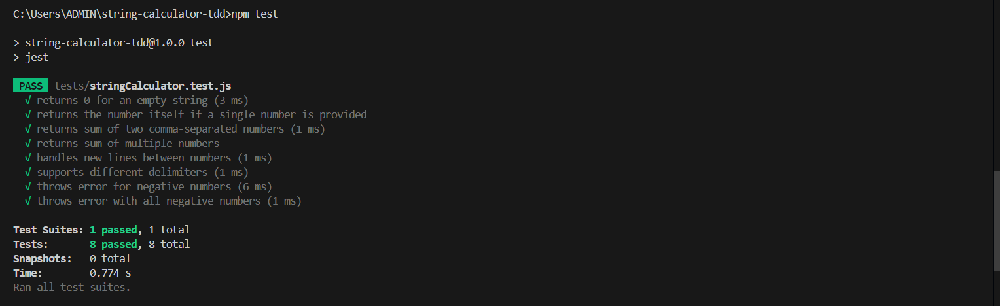
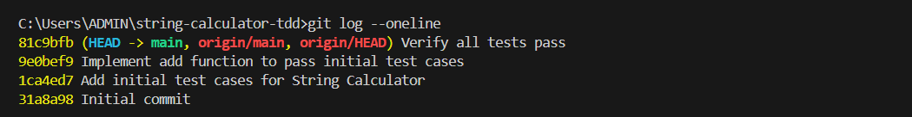

# String Calculator TDD Kata

This repository implements a simple String Calculator using Test-Driven Development.

## Features
- Supports comma and newline delimiters
- Allows custom delimiters
- Throws errors for negative numbers

## Setup

git clone https://github.com/Surya-Reddy21/string-calculator-tdd
cd string-calculator-tdd
npm install

## Running the Tests
npm test

## git commits

